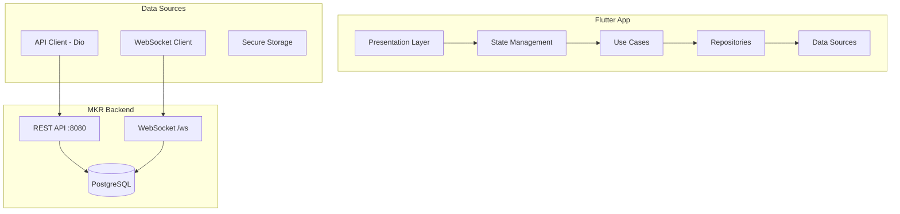

# Design Document

## Overview

Интеграция Flutter iOS приложения с MKR Backend через REST API и WebSocket. Архитектура следует Clean Architecture с разделением на слои: presentation, domain, data. Используется Dio для HTTP запросов, web_socket_channel для WebSocket, и flutter_secure_storage для безопасного хранения токенов.

## Architecture



## Components and Interfaces

### 1. API Configuration

```dart
// lib/core/config/api_config.dart
class ApiConfig {
  static const String devBaseUrl = 'http://localhost:8080';
  static const String prodBaseUrl = 'https://api.mkr-messenger.com';
  
  static String get baseUrl => kDebugMode ? devBaseUrl : prodBaseUrl;
  static String get wsUrl => baseUrl.replaceFirst('http', 'ws') + '/ws';
  
  static const Duration connectTimeout = Duration(seconds: 30);
  static const Duration receiveTimeout = Duration(seconds: 30);
}
```

### 2. API Client (Dio)

```dart
// lib/data/datasources/api_client.dart
class ApiClient {
  final Dio _dio;
  final SecureStorage _storage;
  
  Future<Response> get(String path, {Map<String, dynamic>? queryParams});
  Future<Response> post(String path, {dynamic data});
  Future<Response> put(String path, {dynamic data});
  Future<Response> delete(String path);
  
  void setAuthToken(String token);
  void clearAuthToken();
}
```

### 3. WebSocket Service

```dart
// lib/data/datasources/websocket_service.dart
class WebSocketService {
  WebSocketChannel? _channel;
  StreamController<WsMessage> _messageController;
  
  Future<void> connect(String userId);
  void disconnect();
  void send(WsMessage message);
  Stream<WsMessage> get messages;
  bool get isConnected;
  
  void _handleReconnection();
}

class WsMessage {
  final String type;
  final String payload;
}
```

### 4. Auth Repository

```dart
// lib/data/repositories/auth_repository.dart
abstract class AuthRepository {
  Future<Result<void>> registerEmail(String email, String password, String username, String displayName);
  Future<Result<AuthResponse>> verifyEmail(String email, String code);
  Future<Result<AuthResponse>> loginEmail(String email, String password);
  Future<Result<void>> logout();
  Future<bool> isAuthenticated();
  Future<String?> getCurrentUserId();
}
```

### 5. Chat Repository

```dart
// lib/data/repositories/chat_repository.dart
abstract class ChatRepository {
  Future<Result<List<Chat>>> getChats();
  Future<Result<Chat>> createChat(String type, String name, List<String> participantIds);
  Future<Result<void>> deleteChat(String chatId);
  Stream<Chat> get chatUpdates;
}
```

### 6. Message Repository

```dart
// lib/data/repositories/message_repository.dart
abstract class MessageRepository {
  Future<Result<List<Message>>> getMessages(String chatId, {int? limit, String? before});
  Future<Result<Message>> sendMessage(String chatId, String content, String type);
  Stream<Message> get newMessages;
  void sendTypingIndicator(String chatId);
}
```

### 7. User Repository

```dart
// lib/data/repositories/user_repository.dart
abstract class UserRepository {
  Future<Result<User>> getUser(String userId);
  Future<Result<User>> updateProfile(String displayName, String? bio);
  Future<Result<void>> updateAvatar(String avatarUrl);
  Future<Result<List<User>>> searchUsers(String query);
  Future<Result<void>> updateFcmToken(String token);
}
```

## Data Models

### API Response Models

```dart
// Auth
class AuthResponse {
  final String userId;
  final String token;
  final int accessLevel;
}

class RegisterEmailRequest {
  final String email;
  final String password;
  final String username;
  final String displayName;
}

class LoginEmailRequest {
  final String email;
  final String password;
}

// User
class User {
  final String id;
  final String username;
  final String displayName;
  final String? avatarUrl;
  final String? bio;
  final bool isOnline;
  final bool isVerified;
  final int accessLevel;
}

// Chat
class Chat {
  final String id;
  final String type; // 'direct' or 'group'
  final String name;
  final List<String> participants;
  final Map<String, String> participantNames;
  final int createdAt;
  final Message? lastMessage;
  final int unreadCount;
}

// Message
class Message {
  final String id;
  final String chatId;
  final String senderId;
  final String content;
  final String type; // 'TEXT', 'IMAGE', 'FILE'
  final int timestamp;
  final String status; // 'sent', 'delivered', 'read'
}

// WebSocket
class WsMessage {
  final String type;
  final String payload;
}

class TypingPayload {
  final String chatId;
  final String userId;
  final String userName;
}
```

## Error Handling

```dart
// lib/core/error/api_error.dart
class ApiError {
  final int? statusCode;
  final String message;
  final String? errorCode;
  
  factory ApiError.fromResponse(Response response);
  factory ApiError.network();
  factory ApiError.timeout();
  factory ApiError.unknown(dynamic error);
}

// lib/core/result/result.dart
sealed class Result<T> {
  const Result();
}

class Success<T> extends Result<T> {
  final T data;
  const Success(this.data);
}

class Failure<T> extends Result<T> {
  final ApiError error;
  const Failure(this.error);
}
```


## Correctness Properties

*A property is a characteristic or behavior that should hold true across all valid executions of a system-essentially, a formal statement about what the system should do. Properties serve as the bridge between human-readable specifications and machine-verifiable correctness guarantees.*

### Property 1: API Request Formatting
*For any* API endpoint and request data, the ApiClient SHALL format the request with correct path, method, headers, and JSON body matching the backend API specification.
**Validates: Requirements 2.1, 2.3, 2.5, 4.4, 5.3, 7.2, 7.3, 8.1, 9.2**

### Property 2: Token Storage Round-Trip
*For any* valid JWT token, storing it in SecureStorage and then retrieving it SHALL return the exact same token value.
**Validates: Requirements 2.4, 2.6, 3.1**

### Property 3: Authorization Header Inclusion
*For any* authenticated API request, the request headers SHALL include "Authorization: Bearer {token}" where token is the stored JWT.
**Validates: Requirements 3.2**

### Property 4: Logout Credential Cleanup
*For any* logout operation, all stored credentials (token, userId, user data) SHALL be removed from SecureStorage.
**Validates: Requirements 3.4**

### Property 5: WebSocket Message Parsing
*For any* valid WebSocket message with type in {new_message, typing, user_online, user_offline}, the WebSocketService SHALL parse it correctly and emit the appropriate event.
**Validates: Requirements 5.4, 6.2**

### Property 6: Typing Event Format
*For any* typing indicator sent, the WebSocket message SHALL have type "typing" and payload containing chatId and userId.
**Validates: Requirements 6.3**

### Property 7: Reconnection Backoff
*For any* sequence of WebSocket disconnections, the reconnection delay SHALL increase exponentially (e.g., 1s, 2s, 4s, 8s) up to a maximum.
**Validates: Requirements 6.4**

### Property 8: Error Response Parsing
*For any* API error response with JSON body containing "error" field, the ApiError SHALL extract and preserve the error message.
**Validates: Requirements 10.1**

### Property 9: Error Logging
*For any* API error, the error details (status code, message, endpoint) SHALL be logged.
**Validates: Requirements 10.4**

## Testing Strategy

### Property-Based Testing Library
- **fast_check** package for Dart property-based testing
- Minimum 100 iterations per property test

### Unit Tests
- Test individual components in isolation
- Mock external dependencies (API, WebSocket)
- Cover edge cases and error conditions

### Integration Tests
- Test API client against mock server
- Test WebSocket reconnection logic
- Test auth flow end-to-end

### Test File Structure
```
test/
├── unit/
│   ├── api_client_test.dart
│   ├── websocket_service_test.dart
│   ├── secure_storage_test.dart
│   └── error_handling_test.dart
├── property/
│   ├── api_request_property_test.dart
│   ├── token_storage_property_test.dart
│   ├── websocket_message_property_test.dart
│   └── error_parsing_property_test.dart
└── integration/
    ├── auth_flow_test.dart
    └── chat_flow_test.dart
```

### Property Test Annotations
Each property-based test MUST include a comment referencing the design document:
```dart
// **Feature: flutter-backend-integration, Property 1: API Request Formatting**
// **Validates: Requirements 2.1, 2.3, 2.5, 4.4, 5.3, 7.2, 7.3, 8.1, 9.2**
```
